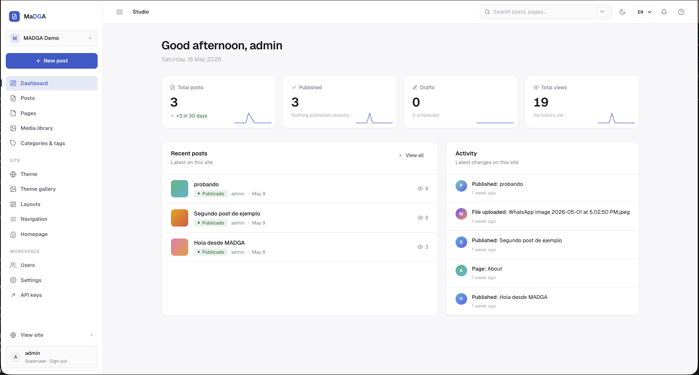

<div align="center">

# MADGA

**Make Django Great Again.** A batteries-included CMS — Studio + headless API + public renderer — shipping as a single reusable Django app.

[](https://pypi.org/project/madga/)
[](https://pypi.org/project/madga/)
[](https://www.djangoproject.com/)
[](LICENSE)
[](https://github.com/jeasoft/madga/actions/workflows/ci.yml)

</div>

<p align="center"><em>Drop it into any Django project. Get a WordPress-grade backoffice, a headless JSON API, and an opinionated public site — without giving up Django.</em></p>

<!-- Hero screenshot of /studio/dashboard/ goes here. Replace the line below
     with:  once captured. -->
<p align="center"></p>

---

## Why MADGA

Django gives you everything to build a CMS — but never the CMS itself. WordPress gives you the CMS but locks you into PHP and a templating model that ages poorly. MADGA splits the difference:

- **You stay in Django.** Models, ORM, signals, admin — untouched.
- **Your editors get a WordPress-grade Studio.** Editor.js with image upload + embeds, drag-and-drop homepage builder, media library with HTMX picker, role-based invitations, live theme tokens with iframe preview.
- **Your frontend can be anything.** Use the public renderer that ships out of the box, plug in your own templates via the theme registry, or go fully headless via the Django Ninja API.
- **Library-grade.** `pip install madga`. Ship via PyPI. Translations included. Postgres + sqlite both first-class. Editors and host project signals are extensible — bring your own `Profile` model, your own block types, your own themes.

---

## Quick start

```bash
pip install madga
```

```python
# settings.py
INSTALLED_APPS = [
    # … django.contrib.* …
    "django.contrib.humanize",
    "madga",                       # must come BEFORE allauth so MADGA's
    "allauth",                     # account templates win the resolve order
    "allauth.account",
    "allauth.headless",
]

MIDDLEWARE = [
    # … standard middleware …
    "django.middleware.locale.LocaleMiddleware",        # after Session, before Common
    "allauth.account.middleware.AccountMiddleware",
    "madga.studio.middleware.MadgaStudioMiddleware",
]

TEMPLATES = [{
    "BACKEND": "django.template.backends.django.DjangoTemplates",
    "APP_DIRS": True,
    "OPTIONS": {"context_processors": [
        "django.template.context_processors.request",
        "django.contrib.auth.context_processors.auth",
        "django.contrib.messages.context_processors.messages",
        "madga.context_processors.current_site",
        "madga.context_processors.studio_topbar",
    ]},
}]
```

```python
# urls.py
from madga.api.router import api as madga_api
from madga.urls import madga_public_urls

urlpatterns = [
    path("admin/", admin.site.urls),
    path("studio/", include("madga.studio.urls")),
    path("api/madga/v1/", madga_api.urls),
    path("accounts/", include("allauth.urls")),
    *madga_public_urls(),    # /, /blog/, /p/<slug>/, /robots.txt, /sitemap.xml, /rss.xml
]
```

```bash
python manage.py migrate
python manage.py madga create-site           # interactive: name, domain, owner
python manage.py runserver
# → http://localhost:8000/studio/
```

That's the whole on-ramp. The `madga` CLI bundles the rest:

```bash
python manage.py madga seed-demo             # 2 posts + 1 page + categories
python manage.py madga blocks                # list registered block types
python manage.py madga build-css [--watch]   # rebuild Tailwind bundles
python manage.py madga backfill-profiles --kind=talent
```

---

## What's in the box

### Studio (`/studio/`)

- **Dashboard** — sparkline stats, recent activity, greeting.
- **Posts** with Editor.js (header, list, quote, code, image, embed, marker, underline, hyperlink, inline code), featured-image picker, SERP preview with character counters, auto-save every 30s, status select with scheduled-publish dates, category + multi-tag, full SEO panel.
- **Pages** same surface as Posts, plus layout selector (`simple` / `sidebar` / `docs`).
- **Media library** with HTMX-driven modal picker that drops into the editor or Featured-image fields. Bulk filter by image / video / document.
- **Categories & tags** with color tokens.
- **Users** with invite-by-email flow, expiring tokens, role enforcement (`owner` / `editor` / `author`).
- **Homepage builder** driven by the block registry — host apps' block types appear in the "Add a block" tray automatically.
- **Theme & theme gallery** — visual tokens (accent, scheme, density, fonts, radius) with live iframe preview; pip-installable third-party themes.
- **Layouts** — pick how each kind (home / blog index / post detail / static page) renders.
- **Navigation** — header + footer columns, drag-to-reorder, with sub-items.
- **Settings** — 4 tabs (general, SEO, integrations, advanced).
- **API keys** — per-user `madga_` tokens for the headless API, with rotate / revoke / delete.
- **Bilingual** — ES / EN out of the box, picker in the topbar.
- **Dark mode** — class-driven, persisted per user.

### Headless API (`/api/madga/v1/`)

Django Ninja, OpenAPI auto-generated:

| Endpoint | Method | Auth |
|---|---|---|
| `/posts/` | GET | bearer |
| `/posts/<slug>/` | GET | bearer |
| `/pages/<slug>/` | GET | bearer |
| `/categories/`, `/tags/`, `/navigation/`, `/homepage/` | GET | bearer |

Authentication is `Authorization: Bearer <key>` — keys are either the per-Site key (visible in Settings → Integrations) or per-user keys minted under Studio → API keys.

### Public site

Renderer comes pre-wired. The chain resolves
`madga/themes/<site.theme>/<kind>.html` → `madga/blog/<kind>.html`,
so you override at any granularity you want. Comes with `robots.txt`,
`sitemap.xml`, `rss.xml`, GA4 + Meta Pixel injection.

For non-blog projects, extend `madga/site_base.html` — it gives you the Site chrome (header nav, footer, theme tokens) and exposes `title`, `meta_description`, `og`, `head_extra`, `content`, `footer`, `body_extra` blocks.

---

## Extending MADGA

### Custom block types

Declare a class, register it, drop a template. It shows up in the homepage builder automatically.

```python
# myapp/blocks.py
from madga.blocks import (
    BlockType, register_block_type,
    TextField, ImageField, ListField,
)

@register_block_type
class TestimonialGridBlock(BlockType):
    key = "myapp_testimonials"
    label = "Testimonials grid"
    description = "A grid of testimonial cards."
    template = "blocks/myapp_testimonials.html"
    fields = [
        TextField("title", "Section title", default="What customers say"),
        ListField(
            "items", "Testimonials",
            item_label="Testimonial",
            item_fields=[
                ImageField("avatar", "Photo"),
                TextField("name", "Name"),
                TextField("role", "Role"),
                TextField("quote", "Quote", multiline=True),
            ],
        ),
    ]
```

```python
# myapp/apps.py
class MyAppConfig(AppConfig):
    name = "myapp"
    def ready(self):
        from . import blocks  # noqa: F401  registers via decorator
```

```html
{# myapp/templates/blocks/myapp_testimonials.html #}

<section>
  <h2>{{ config.title }}</h2>
  
    <article>
      
      <p>{{ item.quote }}</p>
      <cite>— {{ item.name }}, {{ item.role }}</cite>
    </article>
  
</section>
```

#### Field types

| Field | Stored as | Studio widget |
|---|---|---|
| `TextField` | str | `<input>` or `<textarea>` (`multiline=True`) |
| `UrlField` | str | `<input type=url>` (accepts local paths too) |
| `IntField` | int | `<input type=number>` |
| `ChoiceField` | str | `<select>` |
| `ImageField` | MediaFile UUID (str) | Featured-image picker (modal) |
| `ListField` | list[dict] | Repeatable sub-form with add/remove |

#### Block template filters

``:

- `{{ uuid_string|media_url }}` → `MediaFile.file.url`
- `{{ uuid_string|media_alt }}` → `MediaFile.alt_text` or filename

### Custom themes

Drop templates under `yourapp/templates/madga/themes/<theme_name>/`, register a `Theme`, set `Site.theme`.

```python
from madga.themes import Theme, register_theme

@register_theme
class MiscoreTheme(Theme):
    key = "miscore"
    label = "MiScore"
    description = "Bold editorial layout for sports blogs."
    author = "Socio.do"
    accent_color = "#21F69E"
    heading_font = "Source Serif 4"
    body_font = "Inter"
```

### Custom signup profiles (multi-type)

When a user signs up via the public `/accounts/signup/`, MADGA's `user_post_signup` signal fires. If the host project set `request.session["madga_signup_kind"]` before signup (e.g. via a type-picker page), the signal's `kind` argument carries it through:

```python
# myapp/signals.py
from django.dispatch import receiver
from madga.signals import user_post_signup

@receiver(user_post_signup)
def create_profile(sender, user, request, kind, **kw):
    if kind == "talent":
        TalentProfile.objects.create(user=user)
    elif kind == "company":
        CompanyProfile.objects.create(user=user)
```

To populate profiles retroactively after wiring a new receiver:

```bash
python manage.py madga backfill-profiles --kind=talent
```

---

## Configuration

`madga.conf.settings` reads from a project-level `MADGA = {...}` dict:

```python
MADGA = {
    "SITE_DOMAIN": "yoursite.com",
    "DEFAULT_THEME": "default",
    "STUDIO_URL_PREFIX": "studio",
    "API_URL_PREFIX": "api/madga/v1",
    "DEFAULT_PAGINATION": 20,
    "AUTOSAVE_INTERVAL_SECONDS": 30,
}
```

---

## Tests

```bash
pip install -e .[test]
pytest tests/
```

Integration suite covers post lifecycle, page rendering, block registry,
headless API, invitations, role enforcement, public signup signal,
and i18n. The suite runs against sqlite by default; CI also runs it
against Postgres 16 on every push.

### Verify on Postgres locally

```bash
docker run -d --rm --name madga-pg-test \
    -e POSTGRES_PASSWORD=madga -e POSTGRES_USER=madga \
    -e POSTGRES_DB=madga_test -p 55432:5432 postgres:16-alpine

DJANGO_SETTINGS_MODULE=testproject.settings_pg pytest tests/
docker stop madga-pg-test
```

Both sqlite and Postgres are first-class targets — MADGA uses only portable
ORM primitives (`JSONField`, `TextField`, `__icontains`) and ships no raw SQL.

---

## Releases

- **0.3.0** — Foundation for non-blog projects: per-user API keys, profile-extension signal, public signup wired, `site_base.html` for host project extension, Postgres-verified, trusted publishing.
- **0.2.x** — Library-grade reuse: real packaging, single `madga` CLI, multi-language studio, drag-and-drop nav, theme gallery, WordPress-friendly editor toolbar.
- **0.1.x** — Page featured/og images, public URL helper, real invite emails, integration suite.
- **0.0.1** — Studio MVP, Editor.js, Ninja API, baseline.

See [CHANGELOG.md](CHANGELOG.md) for the full list.

---

## License

Apache 2.0 — see [LICENSE](LICENSE).

<div align="center">

Built by [Jearel Alcantara](https://github.com/jeasoft) at [Socio.do](https://socio.do).

</div>
